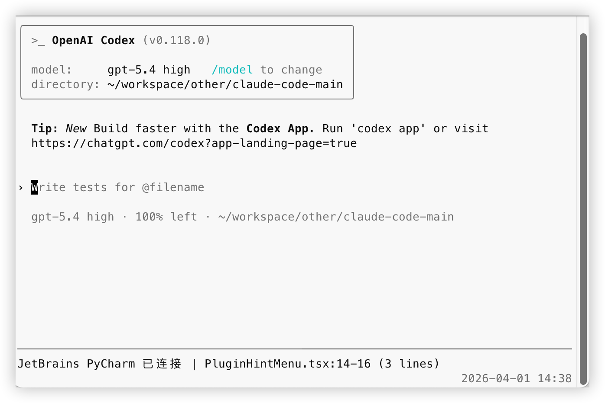

<p align="center">
  <a href="./README.md"></a>
  <a href="./README.en.md"></a>
</p>

# Codex JetBrains 接入说明

> 项目背景：这个适配方案是基于对 `Claude Code v2.1.88` 泄露源码的分析做出来的，目标是让 `Codex` 也具备类似 `Claude Code` 的能力，能够感知 JetBrains 系列 IDE 当前选中的文件、行号和代码范围。
>
> Author: `nealzhi`

本文档只说明一件事：**如何让 Codex 接入 JetBrains IDE 当前选区**。



## 1. 前提

先满足下面两个条件：

1. 你使用的是 JetBrains 系列 IDE  
   例如：`IntelliJ IDEA`、`PyCharm`、`WebStorm`、`GoLand`、`Android Studio`
2. 你的 IDE 已安装 **Claude Code 官方 JetBrains 插件**  
   这是联动前提。没有这个插件，就不会有本地 `~/.claude/ide/*.lock` 和对应的本地接口，Codex 也就无法读取当前选中的文件和代码范围。

## 2. 安装依赖

在仓库根目录执行：

```bash
cd codex-jetbrains-mcp
npm install
brew install tmux
```

说明：

- `npm install`：安装 MCP adapter 依赖
- `tmux`：HUD 依赖

## 3. 给 Codex 接入 MCP

回到仓库根目录执行：

```bash
codex mcp add jetbrains-selection -- node codex-jetbrains-mcp/src/index.mjs
```

说明：

- 这里**不需要**先手动 `npm start`
- Codex 在需要时会自动拉起这个 MCP server
- 这个适配器默认使用 **Codex 当前会话工作目录** 来匹配 JetBrains 当前项目

接入后，Codex 可以调用这个 MCP 工具：

- `jetbrains-selection.jetbrains_get_selection`

## 4. 接入 HUD

在仓库根目录执行：

```bash
chmod +x codex-jetbrains-mcp/bin/codex-jetbrains-hud
```

如果你希望以后直接运行 `codex` 就自动带 HUD，请把下面这一行加到 `~/.zshrc` 或 `~/.bashrc`：

```bash
alias codex='$(pwd)/codex-jetbrains-mcp/bin/codex-jetbrains-hud'
```

重新加载 shell：

```bash
source ~/.zshrc
```

如果你用的是 `bash`，就执行：

```bash
source ~/.bashrc
```

如果你在 macOS 自带终端或 Warp 终端里发现鼠标滚轮无法滚动 Codex 窗口，可以执行下面这条命令开启 `tmux` 鼠标支持：

```bash
tmux set -g mouse on
```

HUD 启动后会显示两行：

```text
JetBrains ● PyCharm · ws · 已连接
Selection: tender_gen_service.py:2140-2147 (8 lines)
```

## 5. 接入全局提示词

把下面这段放进你的 Codex 全局提示词中：

```text
每次用户请求时，先调用 MCP 工具 `jetbrains-selection.jetbrains_get_selection` 获取 JetBrains 当前选区。
如果成功获取到有效的 `filePath`，就优先基于返回的 `filePath`、`lineStart`、`lineEnd` 和 `text` 回答，其中 `lineStart`、`lineEnd` 和 `text` 都可能为空。
要注意：用户可能只选中了文件，此时只有 `filePath`；也可能只选中了某几行，或者只选中了一行里的几个字符。因此要把 `filePath` 视为基础上下文，再结合可用的行号和 `text` 判断用户真正选中的范围。
如果没有获取到有效选区，再提示用户先在 JetBrains IDE 中重新选中代码。
```

## 6. 验证

完成上面步骤后：

1. 打开 JetBrains IDE
2. 启动 `codex`
3. 回到安装了 Claude Code 官方插件的 JetBrains IDE 中选中一段代码
4. 确认 HUD 已显示当前文件和行号
5. 在 Codex 中正常提问，模型会先调用 `jetbrains-selection.jetbrains_get_selection`

如果 HUD 没刷新，最稳的做法是：

- 回到 IDE 里重新点一下文件
- 或重新拖一下选区
